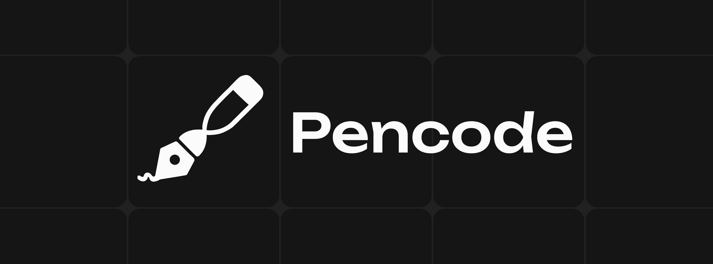

<div align="center">
  
</div>

<div align="center">
  <a href="https://github.com/AhmedSawx/PenCode/actions/workflows/release.yml">
    
  </a>
  <a href="https://github.com/AhmedSawx/PenCode/releases">
    
  </a>
  
</div>

---
> [!WARNING]
> This project is in an early alpha stage. Expect bugs, breaking changes, and incomplete features.

PenCode is a desktop application designed to bridge the gap between code and visual art. It provides a minimalist interface with a powerful, easy-to-learn language for creating generative artwork. The environment features a live-reloading canvas that responds to your code as you type, offering immediate visual feedback.

## Key Features

- **Immediate Visual Feedback**: A live-reloading canvas that automatically updates as you type.
- **Simple, Declarative Language**: An intuitive syntax designed specifically for generative art.
- **Cross-Platform**: Builds and runs on Windows, macOS, and Linux.
- **Custom Brush Engine**: Go beyond basic shapes with a powerful, customizable brush system.
- **Zero-Setup Executables**: Packaged as a single executable file with no installer required.

## Getting Started

The easiest way to get started with PenCode is to download the latest pre-built version for your operating system.

1.  **Download**: Visit the [**Releases**](https://github.com/AhmedSawx/PenCode/releases) page and download the appropriate file for your OS (e.g., `.zip` for Windows, `.tar.gz` for macOS/Linux).
2.  **Extract and Run**: Unzip the file and run the `pencode` executable.
3.  **Create**: From the home screen, create a new project to open the workspace and start coding.

## Development

Interested in contributing or running the project from source? Follow these instructions to set up your development environment.

### Prerequisites

- Python 3.10+
- [Bun](https://bun.sh/)

### 1. Clone the Repository

```sh
git clone https://github.com/AhmedSawx/PenCode.git
cd PenCode
```

### 2. Backend Setup

Create and activate a Python virtual environment.

```sh
# For Linux/macOS
python3 -m venv venv
source venv/bin/activate

# For Windows
python -m venv venv
.\venv\Scripts\activate
```

Install the required Python packages.

```sh
pip install -r requirement.txt
```

### 3. Frontend Setup

Install the frontend dependencies using Bun.

```sh
bun install
```

### 4. Run in Development

Once dependencies are installed, you can start the application.

```sh
python main.py
```

### 5. Building the Executable

To compile the application into a single executable, this project uses Nuitka.

1.  **Build the frontend assets**:
    `sh
bun run build
    `

2.  **Run Nuitka**:
    `sh
python -m nuitka --mode=onefile --enable-plugin=pyside6 --include-data-dir=dist=dist --include-data-dir=public=public main.py
    `

This will create a single executable file in the current directory.

## Contributing

Contributions are welcome! If you have a feature request, bug report, or want to contribute to the code, please feel free to open an issue or submit a pull request.

## Documentation

For detailed information on the Pencode language, components, and architecture, please refer to the official [project documentation](https://ahmedsawx.github.io/pencode-docs/).

## License

This project is licensed under the GPLv3 License. See the `LICENSE` file for details.
